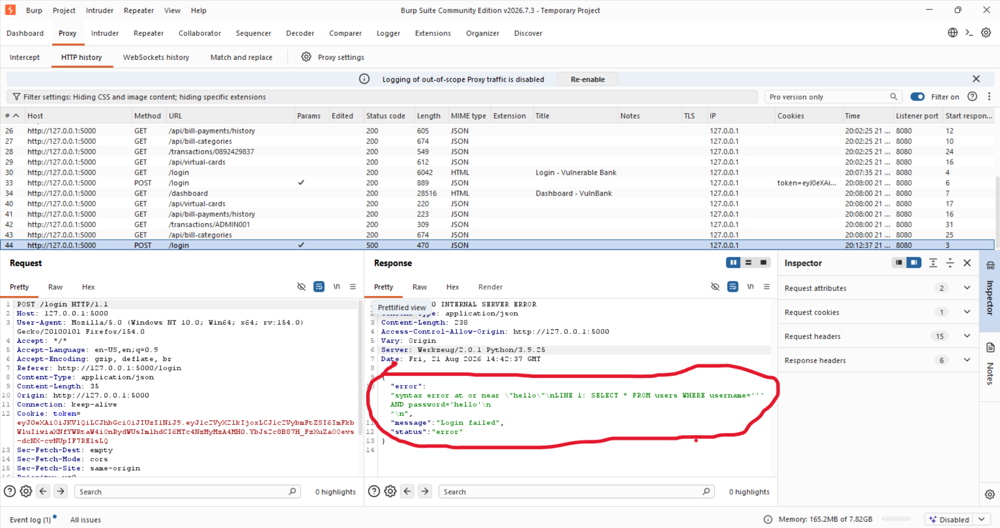

# SQL Injection Testing

## Objective

Determine whether user-controlled input in the login functionality can influence the backend SQL query.

## Initial Observation

During manual testing, a modified value in the `username` parameter caused the application to return a database-related error in the HTTP response.

The response indicated that the application was processing the supplied input as part of a SQL query.

### Evidence

## Manual Testing

The login request contained JSON parameters similar to:

{
    "username": "'",
    "password": "hello"
}

The `username` parameter was selected for further investigation.

## SQLMap Investigation

SQLMap was used against the locally hosted application to further validate and investigate the suspected SQL Injection.

SQLMap identified:

- Injectable parameter: `username`
- Backend DBMS: PostgreSQL
- Available schemas:
  - public
  - information_schema
  - pg_catalog

### Database Enumeration

SQLMap identified tables within the `public` schema.

The assessment identified tables including:

- users
- transactions
- loans
- merchants
- virtual_cards
- bill_payments
- bill_categories
- card_transactions
- billers
- merchant_payments

### Users Table

Further testing showed that the `users` table could be accessed through the SQL Injection vulnerability.

## Impact

Successful exploitation could allow unauthorized access to database information.

Depending on the database privileges and application configuration, SQL Injection may lead to:

- Unauthorized data disclosure
- Authentication bypass
- Modification of database records
- Potentially broader database compromise

## Result

The testing confirmed that the `username` parameter was vulnerable to SQL Injection in the controlled Vulnerable Bank lab environment.